# SBA 308

## General Description

This repository contains a javascript file with several functions that help validate data before parsing it and returning an array of learner objects with key-value pairs of id: learner_id, avg: total_score/total_points_possible, and assignment id: score/points_possible. The number of key-value pairs with assignment id: score/points_possible depends on the number of unique submissions a learner has in the LearnerSubmissions array. The function getLearnerData will return an array with the learner objects only after the course, ag, and submissions arguments have been validated. Otherwise, no array is returned. The validation methods strictly ensure that each course object, ag object, and submissions array contains all necessary keys and that all respective values are the expected type. Otherwise, errors are logged in the console and the validation failed.

## Object Expected Behavior

This is a description of all objects and expected key-value behaviors. The object names of course, assignment group, and submissions are named after the provided data.

<table>
<tr>
<td>Object Name</td> <td>Structure</td> <td>Description</td>
</tr>

<tr>
<td>Course Info</td>
<td>

```javascript
{
  id: 451,
  name: "Introduction to JavaScript",
};
```

</td>
<td>An example of a valid Course Info Object. See comments for expected behavior. More info in the expected behavior section.</td>
</tr>

<tr>
<td>Assignment Group</td>
<td>

```javascript
{
    id: 12345,
    name: "Fundamentals of JavaScript",
    course_id: 451,
    group_weight: 25,
    assignments: [
        {
            id: 1,
            name: "Declare a Variable",
            due_at: "2023-01-25",
            points_possible: 50
        }
    ]
};
```

</td>
<td>An example of a valid Assignment Group Object. Each element of the array will be referred to as an Assignment Object. More info in the expected behavior section.</td>
</tr>

<tr>
<td>Assignment Object</td>
<td>

```javascript
{
    id: 1,
    name: "Declare a Variable",
    due_at: "2023-01-25",
    points_possible: 50
};
```

</td>
<td>An example of a valid Assignment Object. It represents each element of the array and will be referred to as an Assignment Object. More info in the expected behavior section.</td>
</tr>

<tr>
<td>Learner Submissions</td>
<td>

```javascript
[
    {
        learner_id: 125,
        assignment_id: 1,
        submission: {
            submitted_at: "2023-01-25",
            score: 47,
        },
    },
];
```

</td>
<td>An example of a valid Generated Results Array with one entry. Each element of the array will be referred to as a Learner Submission Object. The object nested in the Learner Submission Object will be referred to as the Submission Details Object.</td>
</tr>

<tr>
<td>Learner Submission Object</td>
<td>

```javascript
{
    learner_id: 125,
    assignment_id: 1,
    submission: {
        submitted_at: "2023-01-25",
        score: 47
    }
};
```

</td>
<td>An example of a valid Learner Submission Object. The object nested in this object will be referred to as the Submission Details Object. For the key score, an inclusive upper bound of points_possible from assignment was considered, but extra credit exists. More info on keys and values in the expected behavior section.</td>
</tr>

<tr>
<td>Submission Details Object</td>
<td>

```javascript
{
    submitted_at: "2023-01-25",
    score: 47
};
```

</td>
<td>An example of a valid Submission Details Object. The object nested in this object will be referred to as the Submission Details Object. For the key score, an inclusive upper bound of points_possible from assignment was considered, but extra credit exists. More info on keys and values in the expected behavior section.</td>
</tr>

<tr>
<td>Generated Results</td>
<td>

```javascript
[
    {
        id: 125,
        avg: 0.985,
        1: 0.94,
        2: 1.0,
    },
];
```

</td>
<td>An example of a valid entry within the Generated Results Array. This is the output of the `getLearnerData` function. Each element of the array will be referred to as a Learner Object. More info on keys and values in the expected behavior section.</td>
</tr>

<tr>
<td>Learner Object</td>
<td>

```javascript
{
    id: 125,
    avg: 0.985,
    1: 0.94,
    2: 1.0
};
```

</td>
<td>An example of a valid entry within the Generated Results Array. This will be referred to as a Generated Result Object. More info on keys and values in the expected behavior section.</td>
</tr>

<tr>
<td>Submission Obj</td>
<td>

```javascript
{
    learner_id: 125,
    assignment_id: 1
};
```

</td>
<td>An example of a valid Submision Obj. This will be referred to as a Submission Obj (not to be confused with Submission Details Object). This object is used for verifying that learner submissions in the Learner Submissions Array are unique. More info on keys and values in the expected behavior section.</td>
</tr>
</table>

## Expected Behavior of Key Value Pairs

| Key               | Value Example                 | Value's Behavior                                                                                                                                                                                                                                                                                                  | Usage of Key-Value Pair                                              |
| ----------------- | ----------------------------- | ----------------------------------------------------------------------------------------------------------------------------------------------------------------------------------------------------------------------------------------------------------------------------------------------------------------- | -------------------------------------------------------------------- |
| `id`              | `1`                           | Any integer greater than 0. Otherwise, it is invalid.                                                                                                                                                                                                                                                             | Course Info, Assignment Group, Assignment Object, and Learner Object |
| `name`            | `"Course"`                    | Any non-empty string. Otherwise, it is invalid.                                                                                                                                                                                                                                                                   | Course Info and Assignment Group                                     |
| `course_id`       | `1`                           | Any integer greater than 0 that matches the `id` value of the course. Otherwise, it is invalid.                                                                                                                                                                                                                   | Assignment Group                                                     |
| `group_weight`    | `25`                          | Any integer greater than 0, but less than or equal to 100 because the weight is a percentage. Otherwise, it is invalid.                                                                                                                                                                                           | Assignment Group                                                     |
| `assignments`     | `[{assignment object}]`       | A non-empty array of unique assignment objects with keys `id`, `name`, `due_at`, `points_possible`. If the `id` already exists or other constraints are not met, the assignment is invalid.                                                                                                                       | Assignment Group                                                     |
| `due_at`          | `2025-09-01`                  | A non-empty string in the format of YYYY-MM-DD. Invalid when the format is wrong. If the year (YYYY) does not have 4 characters and the month (MM) and day (DD) do not have 2 characters, date is invalid. If month isn't between 01 and 12 inclusively and the day isn't part of that month, it is also invalid. | Assignment Object                                                    |
| `points_possible` | `1`                           | Any decimal greater than 0. It cannot be 0 because this will be used to calculate the learner's average later on. If these constraints aren't met, it is invalid.                                                                                                                                                 | Assignment Object                                                    |
| `learner_id`      | `1`                           | Any integer greater than 0. Otherwise, it is invalid.                                                                                                                                                                                                                                                             | Learner Submission Object, Submission Obj                            |
| `assignment_id`   | `1`                           | Any integer greater than 0. Otherwise, it is invalid.                                                                                                                                                                                                                                                             | Learner Submission Object, Submission Obj                            |
| `submission`      | `{submission details object}` | A non-empty object of with keys `submitted_at`, `score`. If the `id` already exists or other constraints are not met, the assignment is invalid.                                                                                                                                                                  | Submission Details Object                                            |
| `submitted_at`    | `2025-05-2025`                | A non-empty string in the format of YYYY-MM-DD. Invalid when the format is wrong. If the year (YYYY) does not have 4 characters and the month (MM) and day (DD) do not have 2 characters, date is invalid. If month isn't between 01 and 12 inclusively and the day isn't part of that month, it is also invalid. | Submission Details Object                                            |
| `score`           | `150`                         | Any decimal greater than or equal to 0. Otherwise, it is invalid                                                                                                                                                                                                                                                  | Submission Details Object                                            |
| `avg`             | `0.833`                       | Any decimal greater than or equal to 0, but less than 1. Otherwise, it is invalid.                                                                                                                                                                                                                                | Learner Object                                                       |
| **number**        | `1`                           | The key itself is an assignment id of the Learner Submission Object. The value must be between 0 and 1, inclusive since it is the quotient of the submission's score and the assignment's possible points. If other constraints are not met, it is invalid.                                                       | Learner Object                                                       |

## Description of Functions and Their Parameters

| Function With Parameters                                                                                                         | Arguments Description                                                                                                                                                                                                                                                                                                                                                                    | Function Explanation                                                                                                                                                                                                                                                                                                                                                                                                                                                                                                                                                                                                                                                                                                                                                                                                                                                                                                                                                                                                                                                                                                                                                                                                                                                                                                                                                                                                                                                                                                                                                                                                                                                                                                                                                                                                                                                                                                                                                                                                                                                                                                                                                                                                                                                                                                                                                                                                                                                                                                                                                                                                                                                                       | Expected Output                                                                                                                                                  |
| -------------------------------------------------------------------------------------------------------------------------------- | ---------------------------------------------------------------------------------------------------------------------------------------------------------------------------------------------------------------------------------------------------------------------------------------------------------------------------------------------------------------------------------------- | ------------------------------------------------------------------------------------------------------------------------------------------------------------------------------------------------------------------------------------------------------------------------------------------------------------------------------------------------------------------------------------------------------------------------------------------------------------------------------------------------------------------------------------------------------------------------------------------------------------------------------------------------------------------------------------------------------------------------------------------------------------------------------------------------------------------------------------------------------------------------------------------------------------------------------------------------------------------------------------------------------------------------------------------------------------------------------------------------------------------------------------------------------------------------------------------------------------------------------------------------------------------------------------------------------------------------------------------------------------------------------------------------------------------------------------------------------------------------------------------------------------------------------------------------------------------------------------------------------------------------------------------------------------------------------------------------------------------------------------------------------------------------------------------------------------------------------------------------------------------------------------------------------------------------------------------------------------------------------------------------------------------------------------------------------------------------------------------------------------------------------------------------------------------------------------------------------------------------------------------------------------------------------------------------------------------------------------------------------------------------------------------------------------------------------------------------------------------------------------------------------------------------------------------------------------------------------------------------------------------------------------------------------------------------------------------ | ---------------------------------------------------------------------------------------------------------------------------------------------------------------- |
| `getLearnerData(course, ag, submissions)`                                                                                        | Must contain a course (Course Info object), assignment group (Assignment Group object), and submissions (Learner Submissions array) as arguments when called.                                                                                                                                                                                                                            | The purpose of the function is to output an array of Learner Objects after parsing through course, ag, and submissions. The arguments are validated by their respective functions. More details on validation functions in the table. Validation occurs in the order of course, ag, then submissions. The reason for this is course.id is passed as a parameter for the ag test, so if the course is invalid for any reason, there is no point in continuing with tests. This same logic is applied to ag and submissions; if ag tests failed, there is no reason to attempt submissions tests. If the submissions tests failed, then do not iterate through the submissions array because any errors will create more bugs in the code block afterwards. If all validation tests are passed, a for loop is used to iterate through the submissions array. A for loop is used so that `continue` can be used to skip assignments that are not due yet or not found. The assignment should always found because there is validation that exists to handle edge cases where a learner submits an assignment for an assignment group, but the assignment id does not exist within the group. This `canBeChecked` conditional is placed this early to avoid making or modifying the learner object when the assignment isn't even due yet. The reason is to handle the case of creating the learner object only to find out that this was the only submission from that learner. This will end up leaving an incomplete learner object that will fail tests later on. Next, the function attempts to find the Learner Object in the results array based on the Learner Submission Object's learner_id. If it doesn't exist, create the Learner Object, but only initialize the id, avg (as a placeholder for the total score across all assignments), and totalPoints (as a temporary placeholder for the total points possible across all assignments). Update the `learnerObjIndex` so that the index correctly stores the value of the index the Learner Object is located in the results array. Since the grade of the assignment (score/points_possible) is calculated even if the object didn't exist, do the calculations outside the if block to prevent repeated code. Update the score based on whether it is late. The grade is calculated and pointsPossible for the respective assignment is stored. The proper key-value pairs are added. The values of avg and totalPoints use the += operator to sum up the total score and total points posssible. The logic repeats until the for loop ends. After the for loop ends, calculate the averages using `calculateAvgs(results)`. | Returns an array with data if the arguments are successfully validated, else an empty array.                                                                     |
| `validateCourse(course)`                                                                                                         | Must contain a course (Course Info object) as the argument when called.                                                                                                                                                                                                                                                                                                                  | The function checks if the course provided is valid according to the following criteria. In the first part, the course must be an object and contain the keys id and name. If these tests pass, validate that the values of those keys are the expected types (respective validate functions are explained more thoroughly later). The respective validate functions are explained more thoroughly later and check the key-value table above for expected value behavior. The function assumes that any error thrown at the very end is caught outside the current code block.                                                                                                                                                                                                                                                                                                                                                                                                                                                                                                                                                                                                                                                                                                                                                                                                                                                                                                                                                                                                                                                                                                                                                                                                                                                                                                                                                                                                                                                                                                                                                                                                                                                                                                                                                                                                                                                                                                                                                                                                                                                                                                             | Throws an error only if validation fails. Errors are displayed in an organized manner in the console. Otherwise, it has no return value (will return undefined). |
| `validateAssignmentGroup(assignmentGroup, courseId)`                                                                             | Must contain assignmentGroup (Assignment Group object) and courseId (Course Info object's id) as the arguments when called.                                                                                                                                                                                                                                                              | The function checks if the assignmentGroup provided is valid according to the following criteria. In the first part, the assignment group must be an object and contain the keys id, name, course_id, group_weight, and assignments. If these tests pass, validate that the values of those keys are the expected types. The respective validate functions are explained more thoroughly later and check the key-value table above for expected value behavior. If the assignments array is validated, then iterate through it with a for loop and check that the assignment is valid with validAssignment. If that test is passed, check if the assignment id is unique. If there are no errors, the assignmentGroup is valid. The function assumes that any error thrown at the very end is caught outside the current code block.                                                                                                                                                                                                                                                                                                                                                                                                                                                                                                                                                                                                                                                                                                                                                                                                                                                                                                                                                                                                                                                                                                                                                                                                                                                                                                                                                                                                                                                                                                                                                                                                                                                                                                                                                                                                                                                       | Throws an error only if validation fails. Errors are displayed in an organized manner in the console. Otherwise, it has no return value (will return undefined). |
| `validateAssignment(outerObjectName, assignment, index)`                                                                         | Must contain outerObjectName (string used for descriptive error handling), assignment (Assignment object), and index (number for descriptive error handling) as the arguments when called.                                                                                                                                                                                               | The function checks if the assignment object is valid according to the following criteria. In the first part, the assignment object must be an object and contain the keys id, name, due_at, and points_possible. Check if these tests pass by verifying that no errors were pushed to the assignmentErrors array. Continue if there are no errors in this part and validate the values for each key. If there are no errors, the assignment object is valid. The function assumes that any error thrown at the very end is caught outside the current code block.                                                                                                                                                                                                                                                                                                                                                                                                                                                                                                                                                                                                                                                                                                                                                                                                                                                                                                                                                                                                                                                                                                                                                                                                                                                                                                                                                                                                                                                                                                                                                                                                                                                                                                                                                                                                                                                                                                                                                                                                                                                                                                                         | Throws an error only if validation fails. Errors are displayed in an organized manner in the console. Otherwise, it has no return value (will return undefined). |
| `validateSubmissions(submissions, assignments)`                                                                                  | Must contain submissions (Learner Submissions Array) and assignments (Assignment Group object's assignments array) as the arguments when called.                                                                                                                                                                                                                                         | The function checks if the submissions array provided is valid according to the following criteria. In the first part, the submissions array must be an array and if no errors are pushed onto the submissionErrors array, then this test has passed. The second part focuses on iterating through the submissions array and using validateLearnerSubmission to validate the Learner Submission object structure. If no error is thrown from that method, move onto verifying that the current Learner Submission object is unique based on a unique pair of the learner_id and assignment_id. An array called submissionObjsArray keeps track of this by storing this pairs as a Submission Obj. Each iteration checks if this object already exists and throws an error if a duplicate is found. Otherwise, if all these tests pass, the submissions array is valid. The function assumes that any error thrown at the very end is caught outside the current code block.                                                                                                                                                                                                                                                                                                                                                                                                                                                                                                                                                                                                                                                                                                                                                                                                                                                                                                                                                                                                                                                                                                                                                                                                                                                                                                                                                                                                                                                                                                                                                                                                                                                                                                                | Throws an error only if validation fails. Errors are displayed in an organized manner in the console. Otherwise, it has no return value (will return undefined). |
| `validateLearnerSubmissions(learnerSubmission, assignments, index)`                                                              | Must contain a learnerSubmission (Learner Submission object is used instead of Submission Detail object for descriptive error handling), assignments (Assignment Group object's assignments array), and index (number) as the arguments when called.                                                                                                                                     | The function checks if the learnerSubmission provided is valid according to the following criteria. In the first part, the learnerSubmission must be an object with keys learner_id, assignment_id, and submission. After these tests are passed, validate the values of each key using the respective validation methods. The constraints for each method are explained more thoroughly later. Validating the submission key-value pair is accomplished by the validateInnerSubmission. Otherwise, if all these tests pass, the learner submission object is valid. The function assumes that any error thrown at the very end is caught outside the current code block.                                                                                                                                                                                                                                                                                                                                                                                                                                                                                                                                                                                                                                                                                                                                                                                                                                                                                                                                                                                                                                                                                                                                                                                                                                                                                                                                                                                                                                                                                                                                                                                                                                                                                                                                                                                                                                                                                                                                                                                                                  | Throws an error only if validation fails. Errors are displayed in an organized manner in the console. Otherwise, it has no return value (will return undefined). |
| `validateInnerSubmission(learnerSubmission)`                                                                                     | Must contain a learnerSubmission (Learner Submission object) as the argument when called.                                                                                                                                                                                                                                                                                                | The function checks if the learnerSubmission’s submission details are valid according to the following criteria. In the first part, check if the submission details are an object and if they keys are submitted_at and score. Once these tests pass, validate the values of each key. Otherwise, if all these tests pass, the submission details object is valid. The function assumes that any error thrown at the very end is caught outside the current code block.                                                                                                                                                                                                                                                                                                                                                                                                                                                                                                                                                                                                                                                                                                                                                                                                                                                                                                                                                                                                                                                                                                                                                                                                                                                                                                                                                                                                                                                                                                                                                                                                                                                                                                                                                                                                                                                                                                                                                                                                                                                                                                                                                                                                                    | Throws an error only if validation fails. Errors are displayed in an organized manner in the console. Otherwise, it has no return value (will return undefined). |
| `validateResults(testName, results, expectedResults)`                                                                            | Must contain testName (string), results (array), and the expected results (the hard-coded results provided by the assignment, which is an array of Learner Objects) as the arguments when called.                                                                                                                                                                                        | The function checks if the results are equivalent to the expectedResults. In the first part, check if the results provided are an array. Then verify that the lengths of both arrays are equal before iteration. If both arrays are the same length, then iterate through the results array and use the validateEqualResults method to check for value equality. Push any errors and log errors if resultsErrors is not empty. Otherwise, the results and expectedResults are equal. Log the divider string no matter what for console readability when several tests are performed and logged in the console.                                                                                                                                                                                                                                                                                                                                                                                                                                                                                                                                                                                                                                                                                                                                                                                                                                                                                                                                                                                                                                                                                                                                                                                                                                                                                                                                                                                                                                                                                                                                                                                                                                                                                                                                                                                                                                                                                                                                                                                                                                                                             | Throws an error only if validation fails. Errors are displayed in an organized manner in the console. Otherwise, it has no return value (will return undefined). |
| `validateEqualResults(arrayName, result, expectedResult, resultName, index)`                                                     | Must contain arrayName (string used for descriptive error handling),                                                                                                                                                                                                                                                                                                                     | Checks if two learner objects have equal values. When this function is called, it is a given that the objects have equal keys. Validates id, avg, and every assignment's grade indexed as assignmentId: grade. Validates equality of result and expectedResult.                                                                                                                                                                                                                                                                                                                                                                                                                                                                                                                                                                                                                                                                                                                                                                                                                                                                                                                                                                                                                                                                                                                                                                                                                                                                                                                                                                                                                                                                                                                                                                                                                                                                                                                                                                                                                                                                                                                                                                                                                                                                                                                                                                                                                                                                                                                                                                                                                            | Throws an error if equality fails. Errors are displayed in an organized manner in the console. Otherwise, it has no return value (will return undefined).        |
| `roundNum(number)`                                                                                                               | Must contain a number as the argument when called.                                                                                                                                                                                                                                                                                                                                       | The function removes numbers after the thousandths place if the decimal goes past this place value. Otherwise, do not modify the number. First, the number is converted into a string, then the .includes(".") string method is used to find out if there is a decimal. If there is no decimal, the number is an integer and can be returned as is. Otherwise, split it into an array using .split("."), then check how many digits are after the decimal place by accessing the 2nd element of the array (index 1). If it goes past the hundredth place, use the .toFixed(3) number method to only keep the decimal values up until the thousandths place, inclusive and return the number. Otherwise, it exits the code blocks and will return the original number.                                                                                                                                                                                                                                                                                                                                                                                                                                                                                                                                                                                                                                                                                                                                                                                                                                                                                                                                                                                                                                                                                                                                                                                                                                                                                                                                                                                                                                                                                                                                                                                                                                                                                                                                                                                                                                                                                                                      | Returns `number` or `number` without numbers after the thousandths place.                                                                                        |
| `calculateAvgs(results)`                                                                                                         | Must contain the Generated Results array as its argument.                                                                                                                                                                                                                                                                                                                                | The function iterates through each of the results and assigns the key avg with a value of current avg (buffer of total score) divided by the value of totalPoints. Then, it removes the totalPoints key-value pair. The avg is rounded with roundNum to match the expected output.                                                                                                                                                                                                                                                                                                                                                                                                                                                                                                                                                                                                                                                                                                                                                                                                                                                                                                                                                                                                                                                                                                                                                                                                                                                                                                                                                                                                                                                                                                                                                                                                                                                                                                                                                                                                                                                                                                                                                                                                                                                                                                                                                                                                                                                                                                                                                                                                         | Throws an error if results is invalid or if the object in results is not an object. Otherwise, it does not return anything (will return undefined).              |
| `updateLateScore(assignment, submissionDate, score)`                                                                             | Must contain assignment (Assignment object), submissionDate (string formatted as YYYY-MM-DD), score (number) as arguments when called.                                                                                                                                                                                                                                                   | The function checks if assignment is late and updates score accordingly.                                                                                                                                                                                                                                                                                                                                                                                                                                                                                                                                                                                                                                                                                                                                                                                                                                                                                                                                                                                                                                                                                                                                                                                                                                                                                                                                                                                                                                                                                                                                                                                                                                                                                                                                                                                                                                                                                                                                                                                                                                                                                                                                                                                                                                                                                                                                                                                                                                                                                                                                                                                                                   | Returns the initial score, the score after the penalty is taken, or 0 if the score is less than or equal to the penalty.                                         |
| `includeAssignment(assignment)`                                                                                                  | Must contain assignment (Assignment Group object's assignments array) as the argument when called.                                                                                                                                                                                                                                                                                       | The function checks if assignment is due yet by comparing the assignment's due date to the hard-coded date of `2025-09-05`. Checking if the assignment is due yet is relative to today's date, which is set to when the SBA was assigned.                                                                                                                                                                                                                                                                                                                                                                                                                                                                                                                                                                                                                                                                                                                                                                                                                                                                                                                                                                                                                                                                                                                                                                                                                                                                                                                                                                                                                                                                                                                                                                                                                                                                                                                                                                                                                                                                                                                                                                                                                                                                                                                                                                                                                                                                                                                                                                                                                                                  | Return `boolean` of true or false                                                                                                                                |
| `findAssignment(assignments, assignmentId)`                                                                                      | Must contain assignments (Assignments array) and assignmentId (number) as arguments when called.                                                                                                                                                                                                                                                                                         | The function searches for the assignment object with the key id that is equal to assignmentId. Check if the array is empty before iterating through it.                                                                                                                                                                                                                                                                                                                                                                                                                                                                                                                                                                                                                                                                                                                                                                                                                                                                                                                                                                                                                                                                                                                                                                                                                                                                                                                                                                                                                                                                                                                                                                                                                                                                                                                                                                                                                                                                                                                                                                                                                                                                                                                                                                                                                                                                                                                                                                                                                                                                                                                                    | Returns the index of the assignment object with assignment id = assignmentId. Returns -1 if the assignment object with assignmentId cannot be found.             |
| `findLearnerObj(resultsArray, learnerId)`                                                                                        | Must contain results (Generated Results array) and learnerId (number) as arguments when called.                                                                                                                                                                                                                                                                                          | The function searches for the learner object with the key id that is equal to assignmentId. Check if the array is empty before iterating through it.                                                                                                                                                                                                                                                                                                                                                                                                                                                                                                                                                                                                                                                                                                                                                                                                                                                                                                                                                                                                                                                                                                                                                                                                                                                                                                                                                                                                                                                                                                                                                                                                                                                                                                                                                                                                                                                                                                                                                                                                                                                                                                                                                                                                                                                                                                                                                                                                                                                                                                                                       | Returns the index of the learner object with id = learnerId. Returns -1 if the learner object with learnerId cannot be found.                                    |
| `findLearnerSubmission(objArr, learnerId, assignmentId)`                                                                         | Must contain objArr (An array of Submission Obj), learnerId (number), and assignmentId (number) as arguments when called.                                                                                                                                                                                                                                                                | The function is used to check if a submission is unique based on learner_id and assignment_id based on a custom object (Submission Obj). It is a helper function for validating that a Learner Submission object is unique based on the pair (learner_id, assignment_id)                                                                                                                                                                                                                                                                                                                                                                                                                                                                                                                                                                                                                                                                                                                                                                                                                                                                                                                                                                                                                                                                                                                                                                                                                                                                                                                                                                                                                                                                                                                                                                                                                                                                                                                                                                                                                                                                                                                                                                                                                                                                                                                                                                                                                                                                                                                                                                                                                   | Returns the index of the Submission Obj with learner_id = learnerId and assignment id = assignmentId. Returns -1 if the Submission Obj cannot be found.          |
| `validateKeys(objectName, keys, expectedKeys)`                                                                                   | Must contain objectName (string used for descriptive error handling; name of the object the keys belongs to), keys (array of the object's keys being tested), expectedKeys (array of expected object keys) as arguments when called.                                                                                                                                                     | The function checks if the keys are equal to the expected keys and throws an error if they are not equal (reason is relative to keys). First, check if the keys array is undefined. Then, check the lengths of both arrays. Iterate through the keys array and check if each key is included in the expected keys array. Continue to iterate even if a mismatch is found, but append it to an array of keyErrors. This will provide descriptive feedback on which keys shouldn't exist. A string error message is thrown if validation fails. The function assumes the error is caught outside the current code block.                                                                                                                                                                                                                                                                                                                                                                                                                                                                                                                                                                                                                                                                                                                                                                                                                                                                                                                                                                                                                                                                                                                                                                                                                                                                                                                                                                                                                                                                                                                                                                                                                                                                                                                                                                                                                                                                                                                                                                                                                                                                     | Throws an error only if validation fails. Errors are displayed in an organized manner in the console. Otherwise, it has no return value (will return undefined). |
| `validateId(objectName, id, variableName = "id")`                                                                                | Must contain objectName (string used for descriptive error handling; name of the object the id belongs to), id (id number being validated), and optional variableName (name of the id being validated. Has a default parameter of "id") as arguments when called.                                                                                                                        | The function checks if the id provided is valid based on the following criteria. The id must be defined, have a type of number, cannot be 0 (because in a real world example, ids should not be 0), cannot be negative, and be an integer. A formatted string message is thrown if any of the validation tests fail. The function assumes the error is caught outside the current code block.                                                                                                                                                                                                                                                                                                                                                                                                                                                                                                                                                                                                                                                                                                                                                                                                                                                                                                                                                                                                                                                                                                                                                                                                                                                                                                                                                                                                                                                                                                                                                                                                                                                                                                                                                                                                                                                                                                                                                                                                                                                                                                                                                                                                                                                                                              | Throws an error only if validation fails. Errors are displayed in an organized manner in the console. Otherwise, it has no return value (will return undefined). |
| `validateName(objectName, name, variableName = "name"`                                                                           | Must contain objectName (string used for descriptive error handling; name of the object the name belongs to), name (name string being validated), and optional variableName (name of string name being validated. Has a default parameter of "name") as arguments when called.                                                                                                           | The function checks if the name provided is valid based on the following criteria. The name must be defined, have a type of string, and cannot be empty (because in a real world example, classes need a name). A formatted string message is thrown if any of the validation tests fail. The function assumes the error is caught outside the current code block.                                                                                                                                                                                                                                                                                                                                                                                                                                                                                                                                                                                                                                                                                                                                                                                                                                                                                                                                                                                                                                                                                                                                                                                                                                                                                                                                                                                                                                                                                                                                                                                                                                                                                                                                                                                                                                                                                                                                                                                                                                                                                                                                                                                                                                                                                                                         | Throws an error only if validation fails. Errors are displayed in an organized manner in the console. Otherwise, it has no return value (will return undefined). |
| `validateFloat(objectName, floatNum, variableName)`                                                                              | Must contain objectName (string used for descriptive error handling; name of the object the floatNum belongs to), floatNum (floatNum number being validated), and variableName (name of the floatNum being validated) as arguments when called.                                                                                                                                          | The function checks if the floatNum provided is valid based on the following criteria. The floatNum must be defined, have a type of number, and cannot be negative. In the context of the assignment, the only acceptable float nums are score and points_possible. A formatted message is thrown if any of the validation tests fail. The function assumes the error is caught outside the current code block.                                                                                                                                                                                                                                                                                                                                                                                                                                                                                                                                                                                                                                                                                                                                                                                                                                                                                                                                                                                                                                                                                                                                                                                                                                                                                                                                                                                                                                                                                                                                                                                                                                                                                                                                                                                                                                                                                                                                                                                                                                                                                                                                                                                                                                                                            | Throws an error only if validation fails. Errors are displayed in an organized manner in the console. Otherwise, it has no return value (will return undefined). |
| `validateDate(objectName, date, variableName)`                                                                                   | Must contain objectName (string used for descriptive error handling; name of the object the date belongs to), date (date string being validated), variableName (name of the date being validated)                                                                                                                                                                                        | The function checks if the date provided is valid based on the following criteria. The date must be defined, have a type of string, and must contain at least one - character to pass the first batch of tests. In the second half, split the date string using the - character as the delimiter. Check if there are exactly three parts to the array (year, month, day in this order) before validating the month and date. Year validation is just ensuring that there are 4 characters. Month and day validation ensures that both are exactly 2 characters. If this part of the validation is successful, check if the month and day actually exist by using a month object that a created which has key-value pairs of string "month": number max days. For February, it is assumed that all years are not leap years. A formatted message is thrown if any of the validation tests fail. The function assumes the error is caught outside the current code block.                                                                                                                                                                                                                                                                                                                                                                                                                                                                                                                                                                                                                                                                                                                                                                                                                                                                                                                                                                                                                                                                                                                                                                                                                                                                                                                                                                                                                                                                                                                                                                                                                                                                                                                    | Throws an error only if validation fails. Errors are displayed in an organized manner in the console. Otherwise, it has no return value (will return undefined). |
| `validateArray(objectName, array, arrayName = "")`                                                                               | Must contain objectName (string used for descriptive error handling; name of the object the array belongs to OR the array's name if the arrayName is not provided), array (array being validated), and optional arrayName (name of the array for descriptive error handling)                                                                                                             | The function checks if the array provided is valid based on the following criteria. It is necessary because an array is an object, but objects are not guaranteed to be an array. It checks if the array is defined, if it is an object, is an instance of an Array, and if the array is empty (in this order). A formatted message is thrown if any of the validation tests fail. The function assumes the error is caught outside the current code block.                                                                                                                                                                                                                                                                                                                                                                                                                                                                                                                                                                                                                                                                                                                                                                                                                                                                                                                                                                                                                                                                                                                                                                                                                                                                                                                                                                                                                                                                                                                                                                                                                                                                                                                                                                                                                                                                                                                                                                                                                                                                                                                                                                                                                                | Throws an error only if validation fails. Errors are displayed in an organized manner in the console. Otherwise, it has no return value (will return undefined). |
| `validateObject(objectName, object)`                                                                                             | Must contain objectName (string used for descriptive error handling; name of the object) and object (the object being validated)                                                                                                                                                                                                                                                         | The function checks if the object provided is valid based on the following criteria. It checks if the object is undefined, type of object, and if the object has any keys. A formatted message is thrown if any of the validation tests fail. The function assumes the error is caught outside the current code block.                                                                                                                                                                                                                                                                                                                                                                                                                                                                                                                                                                                                                                                                                                                                                                                                                                                                                                                                                                                                                                                                                                                                                                                                                                                                                                                                                                                                                                                                                                                                                                                                                                                                                                                                                                                                                                                                                                                                                                                                                                                                                                                                                                                                                                                                                                                                                                     | Throws an error only if validation fails. Errors are displayed in an organized manner in the console. Otherwise, it has no return value (will return undefined). |
| `errorMsgUndefined(objectName, variableName = "")`                                                                               | Must contain objectName (string used for descriptive error handling) and optional variableName (string representing the name of the variable, if it isn't used, the objectName is the name itself) as argruments when called.                                                                                                                                                            | Formats error message for undefined values.                                                                                                                                                                                                                                                                                                                                                                                                                                                                                                                                                                                                                                                                                                                                                                                                                                                                                                                                                                                                                                                                                                                                                                                                                                                                                                                                                                                                                                                                                                                                                                                                                                                                                                                                                                                                                                                                                                                                                                                                                                                                                                                                                                                                                                                                                                                                                                                                                                                                                                                                                                                                                                                | Returns the error message for undefined variables.                                                                                                               |
| `errorMsgEmpty(objectName, variableName = "")`                                                                                   | Must contain objectName (string used for descriptive error handling) and optional variableName (string representing the name of the variable, if it isn't used, the objectName is the name itself) as argruments when called.                                                                                                                                                            | Formats error message for empty values (string, object, array).                                                                                                                                                                                                                                                                                                                                                                                                                                                                                                                                                                                                                                                                                                                                                                                                                                                                                                                                                                                                                                                                                                                                                                                                                                                                                                                                                                                                                                                                                                                                                                                                                                                                                                                                                                                                                                                                                                                                                                                                                                                                                                                                                                                                                                                                                                                                                                                                                                                                                                                                                                                                                            | Returns the error message for undefined variables.                                                                                                               |
| `errorMsgWrongPrimitiveType(objectName, variableName = "", type, expectedType)`                                                  | Must contain objectName (string used for descriptive error handling), variableName (string representing the name of the variable, if it is an empty string, the objectName is the name itself), type (string representing the type), expectedType (string representing the expected type) as argruments when called.                                                                     | Formats error message for the wrong primitive value type (string, number, object).                                                                                                                                                                                                                                                                                                                                                                                                                                                                                                                                                                                                                                                                                                                                                                                                                                                                                                                                                                                                                                                                                                                                                                                                                                                                                                                                                                                                                                                                                                                                                                                                                                                                                                                                                                                                                                                                                                                                                                                                                                                                                                                                                                                                                                                                                                                                                                                                                                                                                                                                                                                                         | Returns the error message for undefined variables.                                                                                                               |
| `errorMsgWrongObjectType(objectName, variableName = "", expectedType)`                                                           | Must contain objectName (string used for descriptive error handling), variableName (string representing the name of the variable, if it is an empty string, the objectName is the name itself), and expectedType (string representing the expected type) as argruments when called.                                                                                                      | Formats error message for the wrong object value type (array).                                                                                                                                                                                                                                                                                                                                                                                                                                                                                                                                                                                                                                                                                                                                                                                                                                                                                                                                                                                                                                                                                                                                                                                                                                                                                                                                                                                                                                                                                                                                                                                                                                                                                                                                                                                                                                                                                                                                                                                                                                                                                                                                                                                                                                                                                                                                                                                                                                                                                                                                                                                                                             | Returns the error message for undefined variables.                                                                                                               |
| `errorMsgInvalidNumberValue(objectName, variableName, variable, additionalReason = "", bound = 1, comparisonType = "less than")` | Must contain objectName (string used for descriptive error handling), variableName (string representing the name of the variable), variable (number that isn't valid), optional additionalReason (string with additional error reason), optional bound (number with default value of 1), and optional comparisonType (string explaining the condition being checked >, <, >=, <=, or ==) | Formats error message for an invalid number value.                                                                                                                                                                                                                                                                                                                                                                                                                                                                                                                                                                                                                                                                                                                                                                                                                                                                                                                                                                                                                                                                                                                                                                                                                                                                                                                                                                                                                                                                                                                                                                                                                                                                                                                                                                                                                                                                                                                                                                                                                                                                                                                                                                                                                                                                                                                                                                                                                                                                                                                                                                                                                                         | Returns the error message for undefined variables.                                                                                                               |
| `errorMsgFloatValue(objectName, variableName, variable)`                                                                         | Must contain objectName (string used for descriptive error handling), variableName (string representing the name of the variable),and variable (number that isn't valid)                                                                                                                                                                                                                 | Formats error message for an invalid float number.                                                                                                                                                                                                                                                                                                                                                                                                                                                                                                                                                                                                                                                                                                                                                                                                                                                                                                                                                                                                                                                                                                                                                                                                                                                                                                                                                                                                                                                                                                                                                                                                                                                                                                                                                                                                                                                                                                                                                                                                                                                                                                                                                                                                                                                                                                                                                                                                                                                                                                                                                                                                                                         | Returns the error message for numbers that should be float must meet certain constraints.                                                                        |
| `errorMsgUnequalIds(objectName1, id1, objectName2, id2, idName)`                                                                 | Must contain objectName1 (string name of the first object), id1 (id of the first object), objectName2 (string name of the second object), and id2 (id of the second object)                                                                                                                                                                                                              | Formats error message for objectName1's id not being equal to objectName2's id.                                                                                                                                                                                                                                                                                                                                                                                                                                                                                                                                                                                                                                                                                                                                                                                                                                                                                                                                                                                                                                                                                                                                                                                                                                                                                                                                                                                                                                                                                                                                                                                                                                                                                                                                                                                                                                                                                                                                                                                                                                                                                                                                                                                                                                                                                                                                                                                                                                                                                                                                                                                                            | Returns the error message for unequal ids.                                                                                                                       |

## Reflection and Thoughts

A good chunk of the code is from comments and creating invalid courses, assignment groups, submissions, and results for testing. After completing the minimum requirements of the assignment, most of the remaining time was spent refactoring code. My initial approach to `getLearnerData` made the inaccurate assumption that the submissions array contained Learner Submission Objects that were guaranteed to be ordered by learner_id and assignment_id. This function was refactored to handle the average calculations after iterating through the submissions array and storing the total points possible in a temporary key-value pair. Then, the focus shifted on input validation which led to the creation of a few functions at first, which led to even more functions to prevent unnecessary repetition. The try catch blocks in the validation methods were not consistent initially, but after 3-4 iterations, most of the logic became the same. The only differences were the types of tests needed, quantity of tests (in relation to the variables), template literals based on object/array name, and statements for nested objects/arrays.

## Testing

The original test of feeding in the provided course, assignment group, and submissions is the only test not commented out. Uncomment the other tests to see the errors thrown and logged in the console. The table below describes all of the tests created.

<table>
<tr>
<td>Data with Variable Name</td> <td>Test Case Name & Brief Description</td> <td>Console</td>
</tr>

<tr>
<td>

```javascript
const expectedResult = [
    {
        id: 125,
        avg: 0.985, // (47 + 150) / (50 + 150)
        1: 0.94, // 47 / 50
        2: 1.0, // 150 / 150
    },
    {
        id: 132,
        avg: 0.82, // (39 + 125) / (50 + 150)
        1: 0.78, // 39 / 50
        2: 0.833, // late: (140 - 15) / 150
    },
];
const originalResult = getLearnerData(CourseInfo, AssignmentGroup, LearnerSubmissions);
validateResults("Original Test", originalResult, expectedResult);
```

</td>
<td>Original Test. Regular test to validate that getLearnerData properly parsed data and matches the expectedResults provided. Also confirms that validateResults properly checks for equality between the two arrays.</td> <td>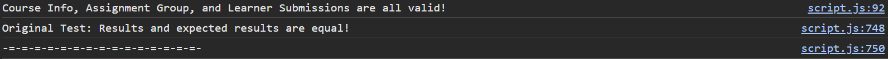</td>
</tr>

<tr>
<td>

```javascript
const differentResult = [
    {
        id: 125,
        avg: 0.985,
        1: 0.94,
        2: 1.0,
    },
    {
        id: 132,
        avg: 0.82,
        1: 0.78,
        2: 0.87, // Diff: Should be 0.833
    },
];
validateResults(
    "Different Expected Results (Different Value for a Key)",
    differentResult,
    expectedResult
);
```

</td>
<td>Tests behavior for different value for a key. Confirm that validateResults gracefully handles wrong value for a key.</td> <td>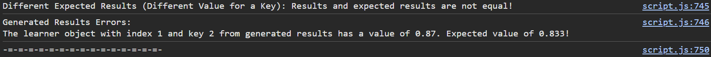</td>
</tr>

<tr>
<td>

```javascript
const differentKeysResult = [
    {
        id: 125,
        average: 0.985,
        assignment1: 0.94,
        assignment2: 1.0,
    },
    {
        id: 132,
        average: 0.82,
        assignment1: 0.78,
        assignment2: 0.833,
    },
];
validateResults(
    "Different Keys in Expected Result (What if objects in the result from getLearnerData have the wrong keys?)",
    differentKeysResult,
    expectedResult
);
```

</td>
<td>Tests behavior for different keys in result. Case for the result having the wrong keys. Confirm that validateResults gracefully handles wrong keys.</td> <td>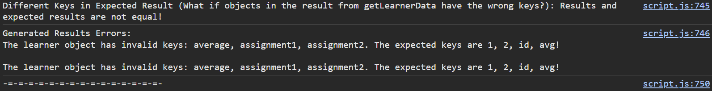</td>
</tr>

<tr>
<td>

```javascript
const moreResult = [
    {
        id: 125,
        avg: 0.985, // (47 + 150) / (50 + 150)
        1: 0.94, // 47 / 50
        2: 1.0, // 150 / 150
    },
    {
        id: 132,
        avg: 0.82, // (39 + 125) / (50 + 150)
        1: 0.78, // 39 / 50
        2: 0.833, // late: (140 - 15) / 150
    },
    {
        id: 139,
        avg: 0.985, // (47 + 150) / (50 + 150)
        1: 0.94, // 47 / 50
        2: 1.0, // 150 / 150
    },
    {
        id: 146,
        avg: 0.82, // (39 + 125) / (50 + 150)
        1: 0.78, // 39 / 50
        2: 0.833, // late: (140 - 15) / 150
    },
];
validateResults("More Results Should be Expected", lessResult, expectedResult);
```

</td>
<td>Tests behavior for more results in the result array than expected. Confirm that validateResults gracefully handles extra data.</td> <td>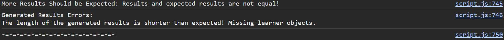</td>
</tr>

<tr>
<td>

```javascript
const lessResult = [
    {
        id: 125,
        avg: 0.985, // (47 + 150) / (50 + 150)
        1: 0.94, // 47 / 50
        2: 1.0, // 150 / 150
    },
];
validateResults("Less Results Should be Expected", moreResult, expectedResult);
```

</td>
<td>Tests behavior for less results in the result array than expected. Confirm that validateResults gracefully handles missing data.</td> <td>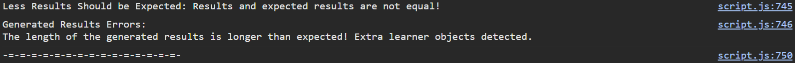</td>
</tr>

<tr>
<td>

```javascript
const wrongTypeResult = [
    {
        id: "125",
        avg: "0.985",
        1: 0.94,
        2: 1.0,
    },
    {
        id: 132,
        avg: 0.82,
        1: "0.78",
        2: "0.833",
    },
];
validateResults("Wrong Value Types for Keys", wrongTypeResult, expectedResult);
```

</td>
<td>Tests behavior for the result containing wrong values for keys. Confirm that validateResults gracefully handles wrong value types for keys.</td> <td>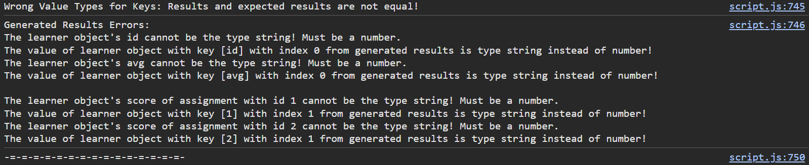</td>
</tr>

<tr>
<td>

```javascript
const emptyCourseInfoResult = getLearnerData(
    {},
    AssignmentGroup,
    LearnerSubmissions
);
validateResults(
    "Empty Course Info Result",
    emptyCourseInfoResult,
    expectedResult
);
```

</td>
<td>Empty Course Info Result. Validate that getLearnerData gracefully handles empty course info. The function validateResults should log statements about the result being empty, thus not equal to expectedResult.</td> <td>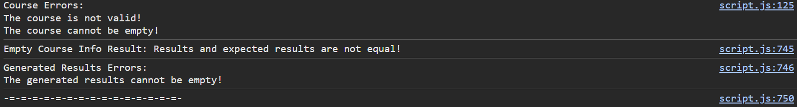</td>
</tr>

<tr>
<td>

```javascript
const wrongCourseInfo = {
    id: "4",
    name: ["This", "is", "not", "a", "string"],
};
const wrongCourseInfoResults = getLearnerData(
    wrongCourseInfo,
    AssignmentGroup,
    LearnerSubmissions
);
validateResults(
    "String Id and Array Name for Course Info",
    wrongCourseInfo,
    expectedResult
);
```

</td>
<td>Tests behavior of both getLearnerData and validateResults when course's id is a string and name is an array. Confirms that getLearnerData and validateResults gracefully handle this scenario.</td> <td>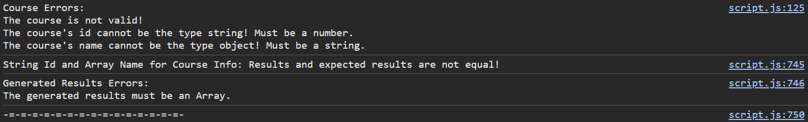</td>
</tr>

<tr>
<td>

```javascript
const wrongCourseInfo2 = {
    id: -643,
    name: "",
};
const wrongCourseInfo2Results = getLearnerData(
    wrongCourseInfo2,
    AssignmentGroup,
    LearnerSubmissions
);
validateResults(
    "Negative Id and Empty Name for Course Info",
    wrongCourseInfo2Results,
    expectedResult
);
```

</td>
<td>Tests behavior of both getLearnerData and validateResults when id is negative and name is an empty string. Confirms that getLearnerData and validateResults gracefully handle this scenario.</td> <td>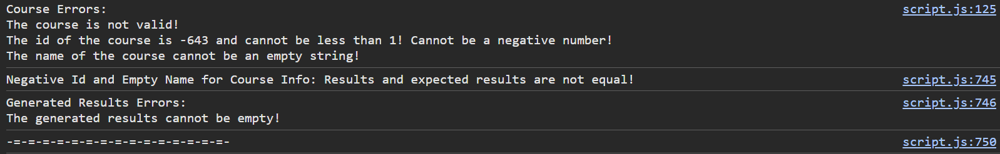</td>
</tr>

<tr>
<td>

```javascript
const wrongCourseInfo3 = {
    id: 7.26,
    name: undefined,
};
const wrongCourseInfo3Results = getLearnerData(
    wrongCourseInfo3,
    AssignmentGroup,
    LearnerSubmissions
);
validateResults(
    "Decimal Id and Undefined Name for Course Info",
    wrongCourseInfo3Results,
    expectedResult
);
```

</td>
<td>Tests behavior of both getLearnerData and validateResults when the course's id is a decimal and course's name is undefined. Confirms that getLearnerData and validateResults gracefully handle this scenario.</td> <td>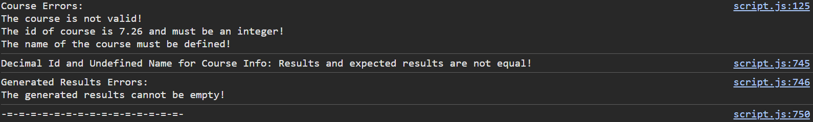</td>
</tr>

<tr>
<td>

```javascript
const wrongCourseInfo4 = {
    identification: 45,
    course_name: "This is a course name",
};
const wrongCourseInfo4Results = getLearnerData(
    wrongCourseInfo4,
    AssignmentGroup,
    LearnerSubmissions
);
validateResults(
    "Wrong Key Names for Course Info",
    wrongCourseInfo4Results,
    expectedResult
);
```

</td>
<td>Tests behavior of both getLearnerData and validateResults when the course's keys are wrong. Confirms that getLearnerData and validateResults gracefully handle this scenario.</td> <td>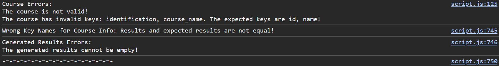</td>
</tr>

<tr>
<td>

```javascript
const wrongCourseInfo5 = {
    id: 30,
    name: "Too many keys!",
    professor: "Professor Louie",
    location: "Remote",
};
const wrongCourseInfo5Results = getLearnerData(
    wrongCourseInfo5,
    AssignmentGroup,
    LearnerSubmissions
);
validateResults(
    "Too Many Keys for Course Info",
    wrongCourseInfo5Results,
    expectedResult
);
```

</td>
<td>Tests behavior of both getLearnerData and validateResults when the course has extra keys. Confirms that getLearnerData and validateResults gracefully handle this scenario.</td> <td>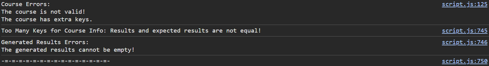</td>
</tr>

<tr>
<td>

```javascript
const wrongCourseInfo6 = {
    id: 40,
};
const wrongCourseInfo6Results = getLearnerData(
    wrongCourseInfo6,
    AssignmentGroup,
    LearnerSubmissions
);
validateResults(
    "Missing Name Key for Course Info",
    wrongCourseInfo6Results,
    expectedResult
);
```

</td>
<td>Tests behavior of both getLearnerData and validateResults when the course has a missing key. Confirms that getLearnerData and validateResults gracefully handle this scenario.</td> <td>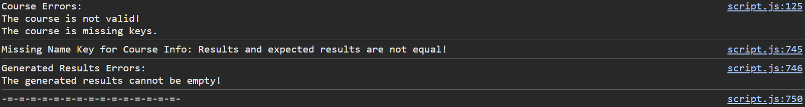</td>
</tr>

<tr>
<td>

```javascript
const emptyAssignmentGroupResult = getLearnerData(
    CourseInfo,
    {},
    LearnerSubmissions
);
validateResults(
    "Empty Assignment Group Result",
    emptyAssignmentGroupResult,
    expectedResult
);
```

</td>
<td>Tests behavior of both getLearnerData and validateResults when assignment group is an object with no key-value pairs. Confirms that getLearnerData and validateResults gracefully handle this scenario.</td> <td>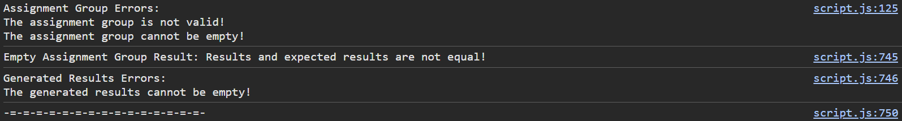</td>
</tr>

<tr>
<td>

```javascript
const wrongCourseIdAG = {
    id: 12345,
    name: "Fundamentals of JavaScript",
    course_id: 45,
    group_weight: 25,
    assignments: [
        {
            id: 1,
            name: "Declare a Variable",
            due_at: "2023-01-25",
            points_possible: 50,
        },
        {
            id: 2,
            name: "Write a Function",
            due_at: "2023-02-27",
            points_possible: 150,
        },
        {
            id: 3,
            name: "Code the World",
            due_at: "3156-11-15",
            points_possible: 500,
        },
    ],
};
const wrongCourseIdAgResults = getLearnerData(
    CourseInfo,
    wrongCourseIdAG,
    LearnerSubmissions
);
validateResults(
    "Assignment Group with Wrong Course Id",
    wrongCourseIdAgResults,
    expectedResult
);
```

</td>
<td>Tests behavior of both getLearnerData and validateResults when assignment group's course id does not match the course's id. Confirms that getLearnerData and validateResults gracefully handle this scenario.</td> <td>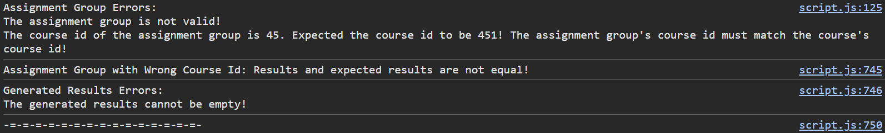</td>
</tr>

<tr>
<td>

```javascript
const highPercentAG = {
    id: 12345,
    name: "Fundamentals of JavaScript",
    course_id: 451,
    group_weight: 125,
    assignments: [
        {
            id: 1,
            name: "Declare a Variable",
            due_at: "2023-01-25",
            points_possible: 50,
        },
        {
            id: 2,
            name: "Write a Function",
            due_at: "2023-02-27",
            points_possible: 150,
        },
        {
            id: 3,
            name: "Code the World",
            due_at: "3156-11-15",
            points_possible: 500,
        },
    ],
};
const highPercentAGResults = getLearnerData(
    CourseInfo,
    highPercentAG,
    LearnerSubmissions
);
validateResults(
    "Assignment Group with Group Weight > 100",
    highPercentAGResults,
    expectedResult
);
```

</td>
<td>Tests behavior of both getLearnerData and validateResults when assignment group's group_weight exceeds 100. Confirms that getLearnerData and validateResults gracefully handle this scenario.</td> <td>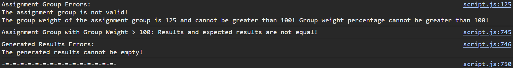</td>
</tr>

<tr>
<td>

```javascript
const erroneousAG = {
    id: -12345,
    name: "",
    course_id: 4.51,
    group_weight: "25",
    assignments: [
        {
            id: 1,
            name: "Declare a Variable",
            due_at: "2023-01-25",
            points_possible: 50,
        },
        {
            id: 2,
            name: "Write a Function",
            due_at: "2023-02-27",
            points_possible: 150,
        },
        {
            id: 3,
            name: "Code the World",
            due_at: "3156-11-15",
            points_possible: 500,
        },
        {
            id: 3, // Repeated id
            name: "Code Outer Space",
            due_at: "5167-10-05",
            points_possible: 5000,
        },
    ],
};
const erroneousAGResult = getLearnerData(
    CourseInfo,
    erroneousAG,
    LearnerSubmissions
);
validateResults(
    "Erroneous Assignment Group",
    erroneousAGResult,
    expectedResult
);
```

</td>
<td>Tests behavior of both getLearnerData and validateResults when assignment group has a negative id, empty name, decimal course_id, wrong type group_weight, and repeated assignments (repeated id of 3). Confirms that getLearnerData and validateResults gracefully handle this scenario.</td> <td>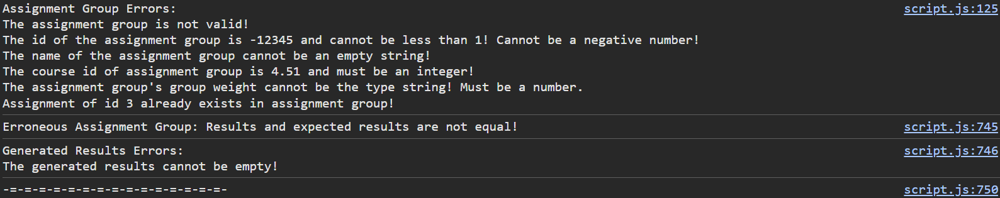</td>
</tr>

<tr>
<td>

```javascript
const wrongAGassignments = {
    id: 12345,
    name: "Fundamentals of JavaScript",
    course_id: 451,
    group_weight: 25,
    assignments: 100,
};
const wrongAGassignmentsResult = getLearnerData(
    CourseInfo,
    wrongAGassignments,
    LearnerSubmissions
);
validateResults(
    "Assignment Group's Assignments With Wrong Type",
    wrongAGassignmentsResult,
    expectedResult
);
```

</td>
<td>Tests behavior of both getLearnerData and validateResults when assignment group's assignments key-value pair has the wrong value type. Confirms that getLearnerData and validateResults gracefully handle this scenario.</td> <td>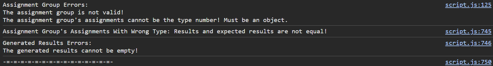</td>
</tr>

<tr>
<td>

```javascript
const wrongAGassignments2 = {
    id: 12345,
    name: "Fundamentals of JavaScript",
    course_id: 451,
    group_weight: 25,
    assignments: [
        {
            id: 1,
            name: "Declare a Variable",
            due_at: "2023-01-25",
            points_possible: 50,
            hasExtraCredit: true,
        },
        {
            id: 2,
            name: "Write a Function",
            due_at: "2023-02-27",
            totalPoints: 150,
        },
        {
            id: 3,
            name: "Code the World",
            due_at: "3156-11-15",
        },
    ],
};
const wrongAGassignments2Result = getLearnerData(
    CourseInfo,
    wrongAGassignments2,
    LearnerSubmissions
);
validateResults(
    "Assignment Group's Assignments With Extra Key, Incorrect Key, and Missing Key",
    wrongAGassignments2Result,
    expectedResult
);
```

</td>
<td>Tests behavior of both getLearnerData and validateResults when assignment group's assignments has an extra key at index 0, incorrect key at index 1 (totalPoints instead of points_possible), and missing key (points_possible) at index 2. Confirms that getLearnerData and validateResults gracefully handle this scenario.</td> <td>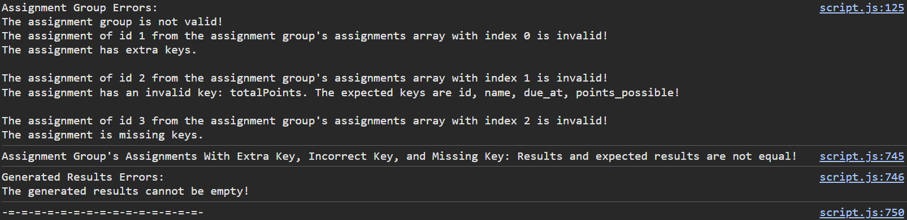</td>
</tr>

<tr>
<td>

```javascript
const wrongAGassignments3 = {
    identification: 12345,
    name: "Fundamentals of JavaScript",
    course_id: 451,
    group_weight: 25,
    assignments: [
        {
            id: 1,
            name: "Declare a Variable",
            due_at: "2023-01-25",
            points_possible: 50,
            hasExtraCredit: true,
        },
        {
            id: 2,
            name: "Write a Function",
            due_at: "2023-02-27",
            totalPoints: 150,
        },
        {
            id: 3,
            name: "Code the World",
            due_at: "3156-11-15",
        },
    ],
};
const wrongAGassignments3Result = getLearnerData(
    CourseInfo,
    wrongAGassignments3,
    LearnerSubmissions
);
validateResults(
    "Assignment Group's Id Key Wrong Name and Assignments Key Errors",
    wrongAGassignments3Result,
    expectedResult
);
```

</td>
<td>Tests behavior of both getLearnerData and validateResults when assignment group's id key is incorrect and the assignments array has the same key errors from before. The key errors from the assignments array do not display in the console as intended because the validation stops when an invalid key is encountered. Confirms that getLearnerData and validateResults gracefully handle this scenario.</td> <td>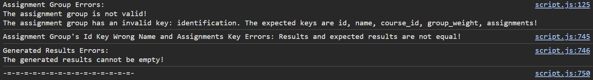</td>
</tr>

<tr>
<td>

```javascript
const emptyLearnerSubmissionsResult = getLearnerData(
    CourseInfo,
    AssignmentGroup,
    []
);
validateResults(
    "Empty Learner Submissions Result",
    emptyLearnerSubmissionsResult,
    expectedResult
);
```

</td>
<td>Tests behavior of both getLearnerData and validateResults when the submissions array is empty. Confirms that getLearnerData and validateResults gracefully handle this scenario.</td> <td>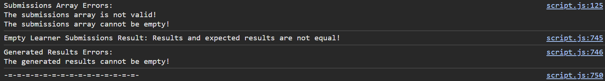</td>
</tr>

<tr>
<td>

```javascript
const unorderedLearnerSubmissions = [
    {
        learner_id: 125,
        assignment_id: 3,
        submission: {
            submitted_at: "2023-01-25",
            score: 400,
        },
    },
    {
        learner_id: 132,
        assignment_id: 2,
        submission: {
            submitted_at: "2023-03-07",
            score: 140,
        },
    },
    {
        learner_id: 125,
        assignment_id: 1,
        submission: {
            submitted_at: "2023-01-25",
            score: 47,
        },
    },
    {
        learner_id: 132,
        assignment_id: 1,
        submission: {
            submitted_at: "2023-01-24",
            score: 39,
        },
    },
    {
        learner_id: 125,
        assignment_id: 2,
        submission: {
            submitted_at: "2023-02-12",
            score: 150,
        },
    },
];
const unorderedResult = getLearnerData(
    CourseInfo,
    AssignmentGroup,
    unorderedLearnerSubmissions
);
validateResults("Unordered Submissions", unorderedResult, expectedResult);
```

</td>
<td>Tests behavior of both getLearnerData and validateResults when the submissions array is not ordered by learner_id and assignment_id. Tests passed because results are unequal. Order does matter because the first learner added is id 132. This is because a learner object is not created for learner id 125 for an assignment not due yet. This is to avoid creating a learner object for someone that only turned in an assignment that is not due yet. Creating that learner object and adding it to the results will result in invalid data. Confirms that getLearnerData and validateResults gracefully handle this scenario.</td> <td>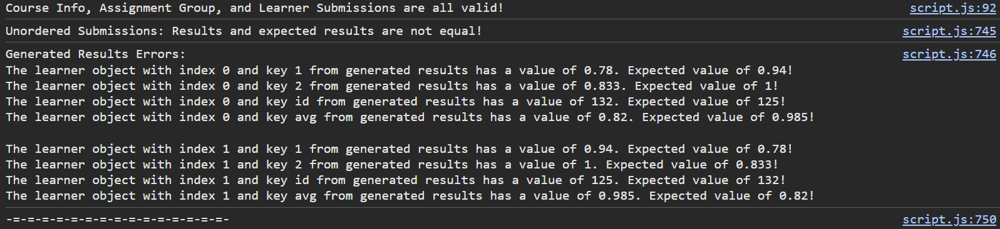</td>
</tr>

<tr>
<td>

```javascript
const duplicateLearnerSubmissions = [
    {
        learner_id: 125,
        assignment_id: 3,
        submission: {
            submitted_at: "2023-01-25",
            score: 400,
        },
    },
    {
        learner_id: 132,
        assignment_id: 2,
        submission: {
            submitted_at: "2023-03-07",
            score: 140,
        },
    },
    {
        learner_id: 125,
        assignment_id: 1,
        submission: {
            submitted_at: "2023-01-25",
            score: 47,
        },
    },
    {
        learner_id: 132,
        assignment_id: 1,
        submission: {
            submitted_at: "2023-01-24",
            score: 39,
        },
    },
    {
        learner_id: 125,
        assignment_id: 2,
        submission: {
            submitted_at: "2023-02-12",
            score: 150,
        },
    },
    {
        learner_id: 132,
        assignment_id: 2,
        submission: {
            submitted_at: "2023-02-27",
            score: 140,
        },
    },
];
const duplicateLSResult = getLearnerData(
    CourseInfo,
    AssignmentGroup,
    duplicateLearnerSubmissions
);
validateResults(
    "Duplicated Entry of Pair (learner_id, assignment_id)",
    duplicateLSResult,
    expectedResult
);
```

</td>
<td>Tests behavior of both getLearnerData and validateResults when the submissions array contains two entries with the same learner_id and assignment_id. An error is thrown because these Learner Submission objects must be unique. Confirms that getLearnerData and validateResults gracefully handle this scenario.</td> <td>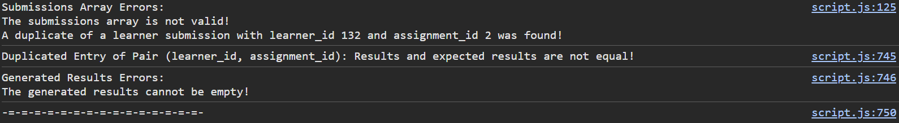</td>
</tr>

<tr>
<td>

```javascript
const wrongLearnerSubs = [
    {
        learner_id: "125",
        assignment_id: undefined,
        submission: {
            date_submitted: "2023-01-25",
            points_earned: 47,
        },
    },
    {
        learner_id: -125,
        assignment_id: 2.3,
        submission: {
            submitted_at: "2023-02-12",
        },
    },
    {
        learner_id: 125,
        submission: {
            submitted_at: "2023-01-25",
            score: 400,
        },
    },
    {
        learner_id: 132,
        assignment_id: 12,
        submission: {
            submitted_at: "2023-01-24",
            score: 39,
            time_submitted: "08:56 PM",
        },
    },
    {
        learner_id: 132,
        assignment_id: 2,
        submission: {
            submitted_at: 2023,
            score: "140",
        },
    },
];
const wrongLearnerSubsResult = getLearnerData(
    CourseInfo,
    AssignmentGroup,
    wrongLearnerSubs
);
validateResults(
    "LearnerSubs With Errors (Check comments by Sub's Declaration)",
    wrongLearnerSubsResult,
    expectedResult
);
```

</td>
<td>Tests behavior of both getLearnerData and validateResults when the submissions array contains various errors. The entry at index 0 contains the wrong learner_id type, undefined assignment_id, and learner submission object with wrong keys (submitted_at -> date_submitted and score -> points_earned) but same amount of keys. The entry at index 1 contains a negative learner_id, assignment_id as a float, and learner submission object with missing key (score). The entry at index 2 contains a missing key of assignment_id. The entry at index 3 contains an assignment_id that doesn't exist in the assignment group object and the learner submission object has an extra key (time_submitted). The entry at index 4 has proper learner_id and assignment_id, but the learner submission object has incorrect value types. Errors are thrown as shown in the image of the console. Confirms that getLearnerData and validateResults gracefully handle this scenario.</td> <td>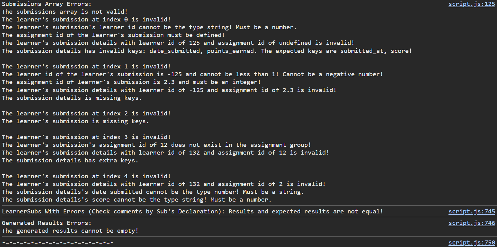</td>
</tr>

<tr>
<td>

```javascript
const wrongLearnerSubs2 = [
    {
        learner_id: 125,
        assignment_id: 1,
        submission: ["2023-01-25", 47],
    },
    {
        learner_id: 125,
        assignment_id: 2,
        submission: {
            submitted_at: "This is not a date",
            score: -150,
        },
    },
    {
        learner_id: 125,
        assignment_id: 3,
        submission: {
            submitted_at: undefined,
            score: undefined,
        },
    },
    {
        learner_id: 132,
        assignment_id: 1,
        submission: {
            submitted_at: "2023-01-39",
            score: 39,
        },
    },
    {
        learner_id: 132,
        assignment_id: 2,
        submission: {
            submitted_at: "2023-13-07",
            score: 140,
        },
    },
    {
        learner_id: 132,
        assignment_id: 3,
        submission: {
            submitted_at: "224-03-07",
            score: 140,
        },
    },
    {
        learner_id: 138,
        assignment_id: 1,
        submission: {
            submitted_at: "2024-03-07-5",
            score: 140,
        },
    },
];
const wrongLearnerSubs2Result = getLearnerData(
    CourseInfo,
    AssignmentGroup,
    wrongLearnerSubs2
);
validateResults(
    "LearnerSubs With Errors (Check comments by Sub's Declaration)",
    wrongLearnerSubs2Result,
    expectedResult
);
```

</td>
<td>Tests behavior of both getLearnerData and validateResults when the submissions with various errors. The entry at index 0 has the learner submission object as an array (this isn't how it should be). Since an array is an object, the numerical indexes are treated as keys, so errors are thrown for mismatching keys. The entry at index 1 contains a learner submission object with correct value types, but invalid values (invalid date and a negative score). The entry at index 2 contains a learner submission object with an undefined score and undefined submitted_at. The entry at index 3 contains a learner submission object with an invalid submitted_at (Nonexistent day of month). The entry at index 4 contains a learner submission object with an invalid submitted_at (Nonexistent month). The entry at index 5 contains a learner submission object with an invalid submitted_at (Year does not have 4 characters as expected). The entry at index 6 contains a learner submission object with an invalid submitted_at (Date has too many '-'). Errors are thrown and logged in an organized manner. Confirms that getLearnerData and validateResults gracefully handle this scenario.</td> <td>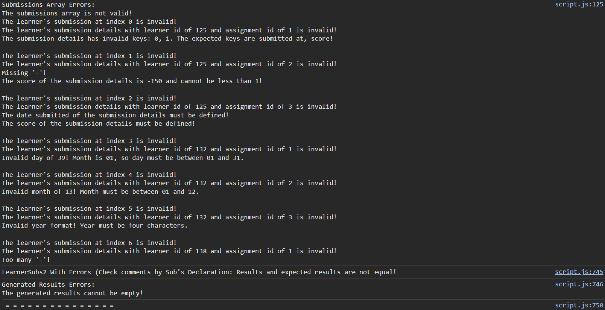</td>
</tr>

</table>
